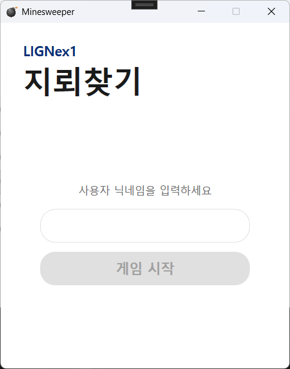
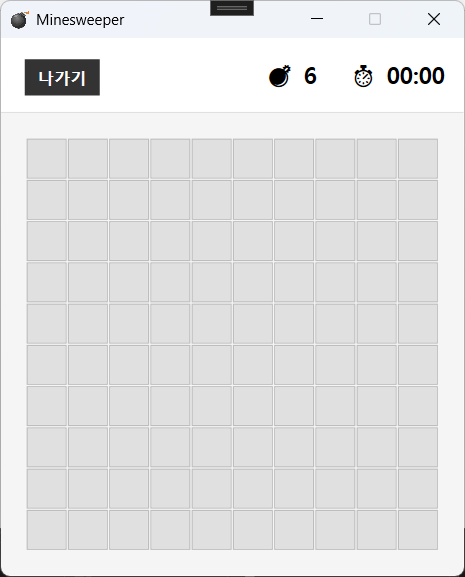
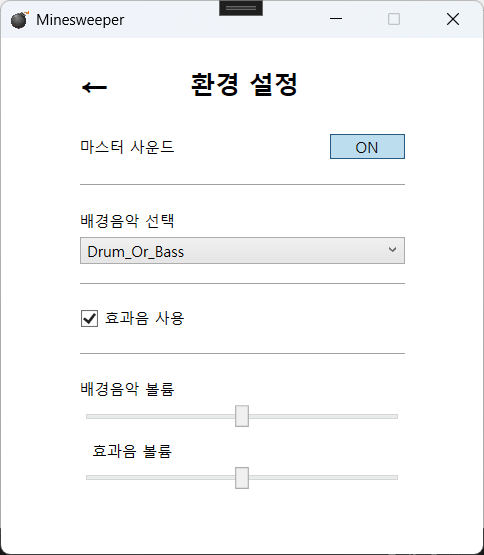

## 💣 WPF Minesweeper (지뢰찾기)
C#과 WPF(Windows Presentation Foundation)를 기반으로 
MVVM 패턴을 준수하여 제작된 윈도우 지뢰찾기 아이디어를 기반으로 한 게임입니다. 
> LIGNex1 The SSEN 강의 중 C#와 WPF 강의를 토대로 제작했으며, 
>일부 내용은 Google Gemini의 도움을 받아 생성되었습니다.
---
## 👥 Members
* KangJunBeom : 프로젝트 총괄, MVVM 아키텍처 설계 및 게임 로직 구현, UI 디자인 담당
* ckstjrl : 음향 환경설정 및 음향 기능 구현 담당
* cheoljun99  : 멀티플레이 기능 구현 담당
* mindidii : 채팅 기능 구현 담당

||||
|:---:|:---:|:---:|:---:|
| **강준범**   [KangJunBeom](https://github.com/KangJunBeom)  |**박찬석**   [ckstjrl](https://github.com/ckstjrl)  |**박철준**   [cheoljun99](https://github.com/cheoljun99) |**김민지**  [mindidii](https://github.com/mindidii)|
---
#### 📺 미리보기 (Screenshots)
</img>
</img>
</img>
</img>
---
### ✨ 핵심 기능 (Main Features)

#### 🎮 게임 플레이 로직
지뢰찾기 표준 규칙을 모두 준수합니다.
1. 빈 공간 자동 확장(Flood Fill)
2. 우클릭 깃발 토글 기능을 지원
3. 첫 클릭 안전 구역 보장

#### 🔥 난이도 시스템
- **쉬움** : 10x10 / 지뢰 6개
- **보통** : 20x20 / 지뢰 40개
- **어려움** : 30x30 / 지뢰 150개
- **극한** : 30x60 / 지뢰 400개

#### 👀 가독성 최적화
- 1~8번 숫자별 색상을 적용해 가독성 극대화

#### 🔖 데이터 및 시스템
- 🔐 **로그인 & 세션** : 사용자 닉네임을 기반으로 플레이 기록을 관리
- ⏱️ **실시간 타이머** : 첫 클릭 시점부터 종료 시점까지의 플레이 시간을 초 단위로 측정하고 시각적으로 표시

#### 💾 저장 및 이어하기 (Save & Load):
- **게임 도중 종료 시,** 현재 판의 상태와 진행 시간을 *savegame.json*에 저장
- **메인 메뉴 진입 시,** 저장 파일이 존재할 때만 '게임 이어하기' 버튼이 활성화
- **데이터 무결성 보장**을 위해 새 게임 시작 시 기존 저장 데이터를 자동으로 삭제하여 데이터 충돌 방지

#### 🏆 랭킹 시스템
- **난이도별 관리** : 각 난이도별로 가장 빠른 클리어 기록 3개를 보관
- **데이터 저장 방식** : rankings.json 파일을 통해 영구 저장되며, 1~3위에게 금(🥇), 은(🥈), 동(🥉) 메달을 부여
- **랭킹 초기화** : 랭킹 초기화를 통해 언제든지 다시 새로운 랭킹 기록에 도전할 수 있음

#### 🎬 시각적/음향 연출
- **승리 애니메이션** : 게임 클리어 시 화면이 어두워지며 "VICTORY!" 문구가 통통 튀어 오르는 스토리보드 기반 애니메이션이 실행
- **다이나믹 UI** : 시작 화면과 메인 메뉴는 크기가 고정되어 변경되지 않지만 게임 진입 시, 지뢰판 크기에 따라 윈도우 창 크기가 자동으로 변경
- **사운드 효과** : 기본적인 백그라운드 음악 설정이 가능하며, 승리/패배 시 SFX 재생
 

#### 🛠️ 기술 스택 (Tech Stack)
- **Language** : C# (.NET)
- **Framework** : WPF
- **Pattern** : MVVM (Model-View-ViewModel)
- **Storage** : JSON (System.Text.Json)
 

#### 📂 프로젝트 구조
MinesweeperProject 
┣ 📂 Models 
┃ ┣ 📜 AudioService.cs  # 음향 기능 관련 속성 
┃ ┣ 📜 Cell.cs          # 지뢰 칸 속성 (IsMine, IsOpened 등) 
┃ ┣ 📜 SaveData.cs      # 저장 파일 구조체 
┃ ┗ 📜 RankingData.cs   # 랭킹 데이터 구조체 
┣ 📂 View 
┃ ┣ 📜 GameView.xaml       # 지뢰판 및 애니메이션 레이어 
┃ ┣ 📜 LoginView.xaml      # 로그인 레이어 
┃ ┣ 📜 MainMenuView.xaml   # 메인메뉴 레이어 
┃ ┣ 📜 RankingView.xaml    # 명예의 전당 UI 
┃ ┗ 📜 SettingView.xaml    # 환경설정 레이어 
┣ 📂 ViewModels 
┃ ┣ 📜 GameViewModel.cs     # 지뢰 로직, 타이머, 승패 판정 
┃ ┣ 📜 LoginViewModel.cs    # 사용자 로그인 처리 
┃ ┣ 📜 MainMenuViewModel.cs # 메인 메뉴 화면 전환 제어 
┃ ┣ 📜 MainViewModel.cs     # 화면 전환 및 윈도우 속성 제어 
┃ ┣ 📜 RankingViewModel.cs  # 랭킹 가공 및 메달 배정 
┃ ┣ 📜 SettingViewModel.cs  # 음향 효과에 대한 속성 제어 
┃ ┗ 📜 ViewModelBase.cs     # 특성 변화에 대한 판정 
┣ 📂 Services 
┃ ┗ 📜 RelayCommand.cs      # 커맨드 바인딩 공통 클래스 
┣ 📂 Resources 
┃ ┣ 📂 BGM    # 백그라운드 음악 파일 저장 폴더 
┃ ┗ 📂 SFX    # 효과음 파일 저장 폴더 
┗ 📜 App.xaml              # 데이터 템플릿(View-ViewModel 매핑) 정의 
(일부 생략) 
 

#### 🚀 실행 방법 (Getting Started)
- **필수** : Visual Studio 2022 이상, .NET 6.0 이상 환경이 필요합니다.
- **Build** : 솔루션 파일을 열고 Build (F6)를 수행합니다.
- **Run** : F5를 눌러 게임을 실행합니다.
- **Data** : 실행 파일 폴더 내에 savegame.json과 rankings.json이 자동 생성됩니다.
